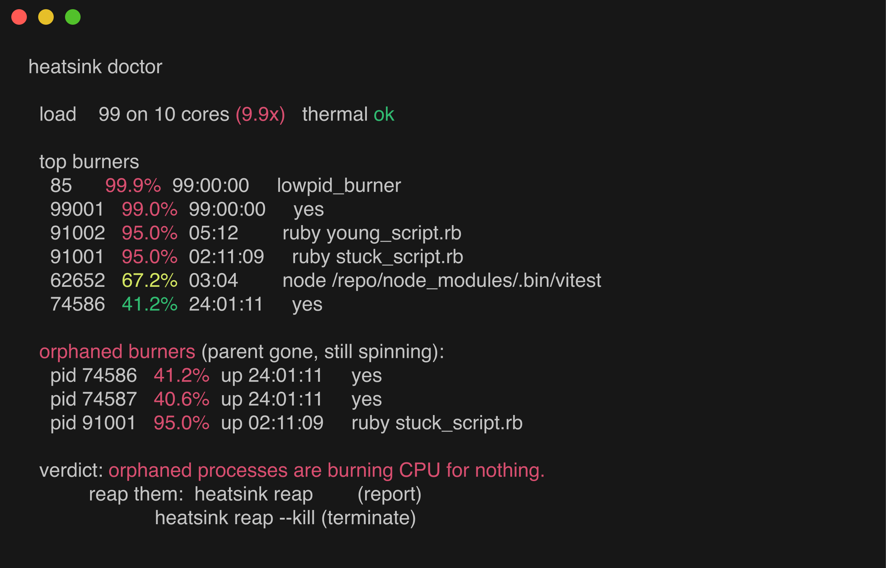
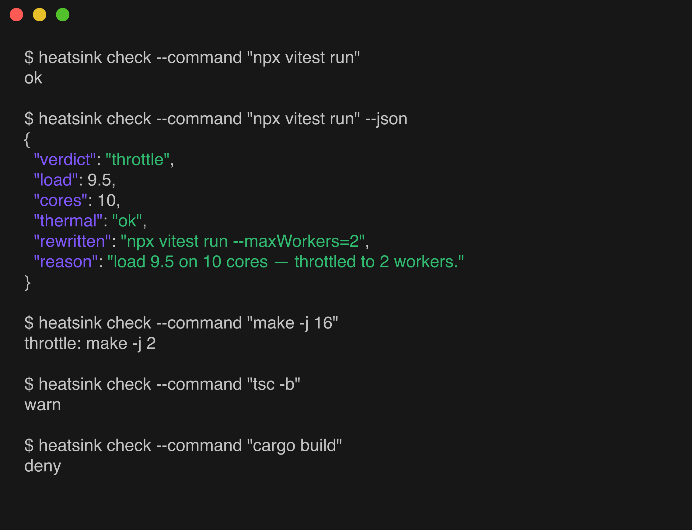
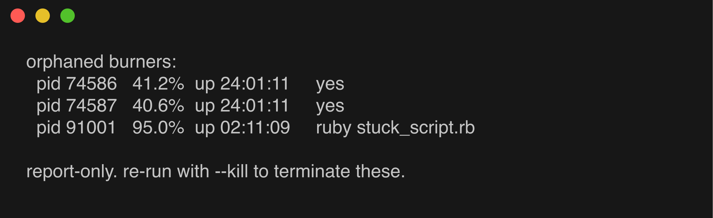

# heatsink — Your AI coding agent doesn't know your laptop is on fire.



## The war story

My MacBook is a 10-core machine. One afternoon it sat at a load average of
**99**. Not 9.9 — 99. Ten cores, ninety-nine runnable processes queued up
behind them.

The cause: ten orphaned `yes` processes, each pinned to a core, each burning
CPU for nothing, for **24 hours straight**. Somewhere along the way an agent
had spun up a background loop, the parent that was supposed to manage it
died or moved on, and the children just kept running — orphaned, invisible,
permanent. On top of that pile, a parallel vitest suite (also agent-spawned)
tried to fan out across every core it could find.

The agent doing all this had no idea any of it was happening. It saw a shell,
it ran a command, the command returned (eventually), it moved to the next
task. It had no concept of "the machine is on fire" — no load signal, no
thermal signal, no notion that the last five commands it ran are still
running. It just kept scheduling more parallel work onto a machine that
had none left to give.

heatsink exists so that never has to happen silently again.

## What it does

heatsink sits between an AI coding agent and your shell. Before a command
runs, it checks load and thermal state and does one of four things:

- **ok** — nothing unusual, run as-is.
- **warn** — near saturation, command runs but the agent is told to hold off
  on stacking more parallel work.
- **throttle** — command matches a known heavy build/test runner and has a
  parallelism knob heatsink can safely lower; the rewritten command runs
  instead.
- **deny** — already oversubscribed, or near saturation while the OS is
  thermally throttling; the command doesn't run at all.

**The one invariant that matters: a rewrite only ever *reduces* parallelism.**
heatsink never raises a worker count, never adds `-j` to a bare `make`, and
never guesses at a knob it isn't sure about — when it can't rewrite safely,
it warns instead of mangling your command.

### Auto-throttle table

| Command | How it's detected | Rewrite behavior |
|---|---|---|
| `rspec`, `parallel_rspec`, `parallel_test(s)` | `PARALLEL_TEST_PROCESSORS=N` env var | Lowers an existing value, or prepends the env var if absent |
| `vitest`, `jest` | `--maxWorkers[= ]N` | Lowers an existing value, or appends `--maxWorkers=N` if absent |
| `playwright` | `--workers[= ]N` | Lowers an existing value, or appends `--workers=N` if absent |
| `pytest` | `-n`/`--numprocesses N` | Lowers an existing value; if pytest-xdist isn't already in use, **warns instead of adding `-n`** — forcing it on could break a suite that never installed xdist |
| `cargo test` | `--test-threads[= ]N` | Lowers an existing value, or appends `-- --test-threads=N` if absent |
| `cargo build` | `CARGO_BUILD_JOBS=N` env var | Lowers an existing value, or prepends the env var if absent |
| `go test` | `-p`, `-p=`, or `-pN` (all three forms) | Lowers an existing value, or appends `-p N` if absent |
| `make`, `cmake --build` | `-j N` | Lowers an existing value; **bare invocations (no `-j`) are left alone** — make defaults to serial, and heatsink never adds parallelism, only removes it |
| `npm`/`yarn`/`pnpm`/`bun` `test`/`build`, `turbo run` | a forwarded `--maxWorkers`/`--workers` flag | Env var `VITEST_MAX_THREADS=N` always prepended; forwarded flag also lowered in place when higher than N; at/below target flag passes unchanged |
| `webpack`, `tsc`, `gradle`, `mvn`, `bazel` | — | Flagged as heavy but has no known safe knob — always **warn**, never rewritten |

## Usage

```
heatsink check --command "<cmd>" [--json]   verdict: ok|warn|throttle|deny
heatsink doctor                             why is my machine hot?
heatsink reap [--kill]                      find (and optionally kill) orphaned burners
heatsink wrap -- <cmd>                      throttle-if-needed, then run
heatsink hook <claude-code|cursor|codex>    harness hook entrypoint (stdin JSON)
```

### The four verdicts, end to end

Exit code is `0` for ok/warn/throttle and `1` for deny (`wrap` exits
`75`/`EX_TEMPFAIL` on deny so a CI job can retry).



**ok** — machine is quiet, nothing happens:

```console
$ heatsink check --command "npx vitest run"
ok
```

**throttle** — load is in the throttle zone and the command has a safe knob:

```console
$ heatsink check --command "npx vitest run" --json
{
  "verdict": "throttle",
  "load": 3.58,
  "cores": 10,
  "thermal": "ok",
  "rewritten": "npx vitest run --maxWorkers=2",
  "reason": "load 3.58 on 10 cores — throttled to 2 workers."
}

$ heatsink check --command "make -j 16"
throttle: make -j 2
```

**warn** — heavy command, no knob heatsink can safely turn:

```console
$ heatsink check --command "tsc -b"
warn
```

**deny** — already oversubscribed, command does not run:

```console
$ heatsink check --command "cargo build"
deny
$ echo $?
1
```

### `wrap` — guard a command you're about to run

```console
$ heatsink wrap -- go test ./...
heatsink: throttled -> go test ./... -p 2
...your test output, unchanged...

$ heatsink wrap -- npx vitest run     # when denied
heatsink: DENIED — load 21.4 on 10 cores (thermal: ok) — oversubscribed.
Wait for load to drop, or run with reduced parallelism.
$ echo $?
75
```

In a Makefile or CI job:

```make
test:
	heatsink wrap -- npx vitest run
```

### `hook` — what the agent actually sees

The adapters pipe the harness's hook JSON in and emit the harness's own
response format back out. Claude Code, throttle case:

```console
$ echo '{"tool_input":{"command":"npx vitest run"}}' | heatsink hook claude-code
{
  "hookSpecificOutput": {
    "hookEventName": "PreToolUse",
    "updatedInput": {
      "command": "npx vitest run --maxWorkers=2"
    }
  },
  "systemMessage": "heatsink: load 9.5 on 10 cores — throttled to 2 workers. -> npx vitest run --maxWorkers=2"
}
```

Deny case — the command never reaches the shell, and the agent is told why:

```console
$ echo '{"tool_input":{"command":"cargo build"}}' | heatsink hook claude-code
{
  "hookSpecificOutput": {
    "hookEventName": "PreToolUse",
    "permissionDecision": "deny",
    "permissionDecisionReason": "heatsink: load 21.4 on 10 cores (thermal: ok) — oversubscribed. Wait for load to drop, or run with reduced parallelism. Check with: heatsink doctor"
  },
  "systemMessage": "heatsink: blocked a heavy command (load 21.4 on 10 cores)"
}
```

`warn` returns `additionalContext` instead — the command runs, but the agent
is told not to stack more parallel work on top of it.

### Tuning, in practice

Thresholds are env vars, so you can tighten them per shell or per job:

```console
# aggressive: throttle at half a core per job, deny at 1.2x
$ HEATSINK_THROTTLE_RATIO=0.5 HEATSINK_DENY_RATIO=1.2 heatsink wrap -- make -j 16

# never rewrite below 4 workers
$ HEATSINK_MIN_WORKERS=4 heatsink check --command "npx jest"
throttle: npx jest --maxWorkers=4
```

### `doctor` — why is my machine hot?


`doctor` shows your load-to-core ratio, the top CPU consumers on the box, and
separately calls out **orphans**: processes whose parent process is gone but
that are still spinning (the reap-safe signal — a process that's still
attached to a live parent is never a reap candidate).

### `reap` — clean up the orphans

```bash
heatsink reap          # report-only: lists orphaned burners, kills nothing
heatsink reap --kill   # SIGTERM, wait, SIGKILL any survivors
```



`reap` defaults to report-only on purpose — a guard that can autonomously
kill your processes is a guard nobody will trust. You always have to ask for
`--kill` explicitly.

## Install

**Prerequisites:** bash and `jq`. macOS 15+ ships `jq`; on Linux install it
first (`apt install jq` / `dnf install jq`). Without `jq` the hook adapters
fail open — heatsink will appear installed but never guard anything.

macOS, Linux and Windows are all supported — see [Windows](#windows) for what
that means there.

**Claude Code (plugin):**

```
/plugin marketplace add sundarshahi/heatsink
/plugin install heatsink@heatsink
```

The plugin wires itself into Claude Code's `PreToolUse` hook automatically —
no further setup.

**CLI (any agent, any shell):**

```bash
git clone https://github.com/sundarshahi/heatsink
cd heatsink
make install   # installs to ~/.local/bin
```

Make sure `~/.local/bin` is on your `PATH`
(`export PATH="$HOME/.local/bin:$PATH"` — it isn't by default on macOS),
then verify with `heatsink doctor`.

**CLI (npm):**

```bash
npx @sundarshahi/heatsink doctor      # run without installing
npm install -g @sundarshahi/heatsink  # or install globally
```

Still needs `jq` on your `PATH` — npm ships the scripts, not the dependency.

## Windows

heatsink is bash, so it runs under **Git Bash** (Git for Windows) — which
Claude Code on Windows already requires. Install with npm, not `make install`:
npm's shim invokes the script through `bash` on your `PATH`, while
`make install` relies on symlinks that MSYS may turn into copies.

```powershell
winget install Git.Git jqlang.jq
npm install -g @sundarshahi/heatsink
heatsink doctor
```

Two signals are read differently there, because Windows has no POSIX
equivalent:

| Signal | Windows source |
|---|---|
| load | `ProcessorQueueLength` + busy cores, via one `powershell.exe` call — the same quantity Linux's loadavg measures, sampled instantaneously instead of decayed over a minute |
| processes | `Win32_Process`, sampled twice 300ms apart for a real `%CPU`; a process whose parent has exited is reported as `ppid 1`, so `reap` finds orphans the same way it does elsewhere |
| thermal | always `ok` — see [below](#why-no-temperature-on-macos-or-windows) |
| kill | `taskkill`, since MSYS signals never reach native Windows processes |

Cygwin's `/proc/loadavg` is deliberately ignored: it exists on Git Bash but
does not track the Windows scheduler, so trusting it would report a calm
machine while it cooks.

The `powershell.exe` spawn costs a few hundred ms, so heatsink classifies the
command *before* reading load — a `git status` never pays it, and `check
--json` reports `"load": null` when it never needed to measure.

**Everything else is identical**: same rewrite table, same thresholds, same
adapters, same fail-open behavior. The Claude Code plugin works unchanged.

Prefer WSL2? That works too, and is the plain Linux path — but run the agent
inside WSL as well. An agent on the Windows side with heatsink in WSL guards
nothing: different process tree, different load.

## Adapter status

| Adapter | Status |
|---|---|
| `claude-code` | tested |
| [`cursor`](adapters/cursor/README.md) | untested in the wild |
| [`codex`](adapters/codex/README.md) | experimental |
| generic [`wrap`](adapters/generic/README.md) | tested |

`cursor` is built against Cursor's documented `beforeShellExecution` hooks
contract but isn't exercised in CI against a real Cursor install. `codex`
speaks a minimal stdin/stdout contract since Codex's own hook surface isn't
stable yet. If either misbehaves against a real harness, please open an
issue with the raw hook input/output — that's exactly the feedback needed to
move them out of "untested."

The generic `wrap` command works with anything that can shell out — CI jobs,
Makefiles, pre-commit hooks, or an agent with no native hook surface at all:

```bash
heatsink wrap -- bundle exec rspec spec/
```

## Tuning

heatsink's thresholds are load-ratio-based (load average ÷ core count), and
every one of them is an environment variable:

| Variable | Default | Meaning |
|---|---|---|
| `HEATSINK_DENY_RATIO` | `2.0` | load/cores at or above this → **deny** (oversubscribed) |
| `HEATSINK_THROTTLE_RATIO` | `0.9` | load/cores at or above this → **throttle/warn** zone |
| `HEATSINK_MIN_WORKERS` | `2` | floor on the worker count heatsink will rewrite down to (target is `max(MIN_WORKERS, cores/4)`) |

## Why no temperature on macOS or Windows

macOS exposes no root-free CPU thermometer. The only interface that reports
actual junction temperature, `powermetrics`, requires `sudo` — and a guard
that has to ask for `sudo` to make a safety decision is a guard that will get
disabled the first time it's inconvenient. heatsink never asks for elevated
privileges.

Instead, on macOS heatsink governs **load** — the thing that's actually
causing the problem — and reads the OS's own throttle signal when it
surfaces one (`pmset -g therm`, checking `CPU_Speed_Limit`). If macOS itself
is throttling the CPU, heatsink treats that as thermal pressure and
escalates the throttle-zone verdict straight to deny.

Windows is worse: `MSAcpi_ThermalZoneTemperature` is the only vendor-neutral
interface, most laptop firmware doesn't implement it, and where it does the
reading is often the chassis rather than the CPU. So Windows reports `ok` and
load governs alone, exactly as on macOS.

On Linux, no such workaround is needed: `/sys/class/thermal/thermal_zone*/temp`
is readable without elevated privileges, so heatsink reads real per-zone
temperatures directly and treats 85°C or above as thermal pressure.

## Known limitation

heatsink classifies and rewrites a command as a single unit. For a compound
command (`cmd1 && cmd2`), only the **first pattern that matches** in
heatsink's classifier gets rewritten — the rest of the chain runs verbatim,
untouched, whether or not it's also heavy. If you're chaining multiple heavy
commands together, either wrap them separately or expect only one leg of the
chain to be throttled.

## Fail-open guarantee

Every layer of heatsink is designed to fail open. If `jq` isn't installed, if
stdin isn't valid JSON, if a signal read fails, if anything at all goes
wrong — heatsink gets out of the way and your command runs exactly as you
typed it. A guard that can break your workflow by breaking itself is worse
than no guard at all.

## Development

```bash
make lint   # needs shellcheck:  brew install shellcheck  /  apt install shellcheck
make test   # needs bats:        brew install bats-core   /  apt install bats
```

## License

MIT — see [LICENSE](LICENSE).
